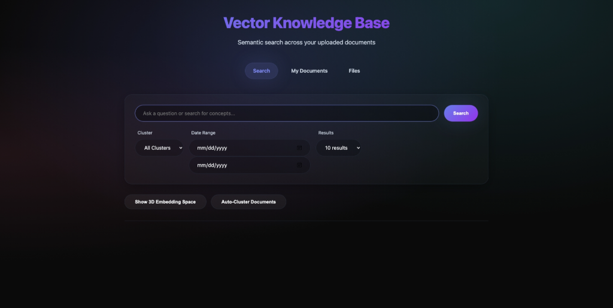
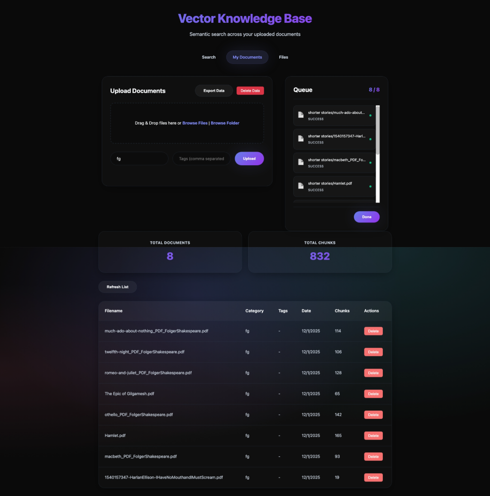
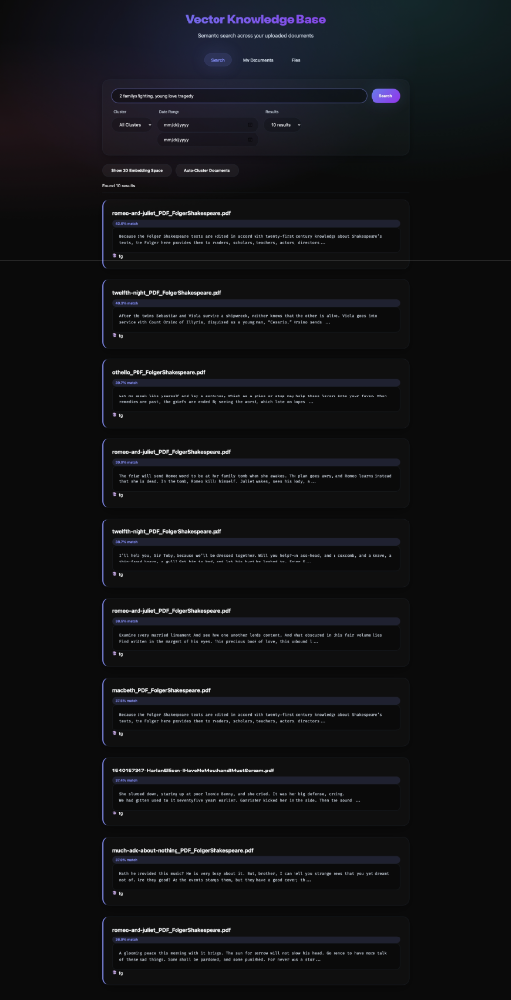
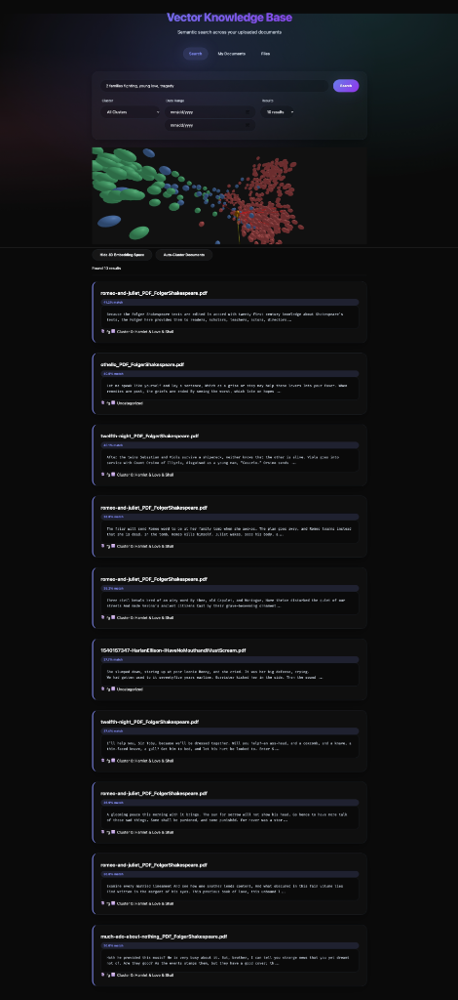
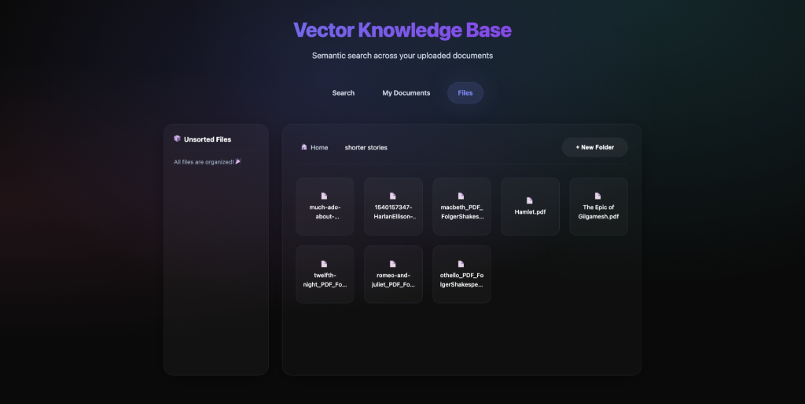

# Vector Knowledge Base

*A personal semantic search engine for your documents and knowledge base*

[](https://www.python.org)
[](https://fastapi.tiangolo.com)
[](https://qdrant.tech)
[](LICENSE)

[Features](#features) • [Quick Start](#quick-start) • [Usage](#usage) • [Architecture](#architecture) • [API Reference](#api-reference)

---

**Vector Knowledge Base** is a vector database application that transforms your documents into a searchable knowledge base using semantic search. Upload PDFs, Word documents, and code files, then search using natural language to find exactly what you need.

## Features

- **Semantic Search** - Find documents by meaning, not just keywords
- **Auto-Clustering** - Automatically organize documents into semantic clusters using HDBSCAN (density-based clustering)
- **Semantic Cluster Naming** - Clusters are automatically named using TF-IDF keyword extraction (e.g., "Shakespeare & Drama", "Python & Programming")
- **Cluster-Based Filtering** - Filter search results by document clusters for more focused searches
- **Batch Upload & Folder Preservation** - Drag and drop entire folders to upload, automatically preserving folder structure in your knowledge base
- **3D Embedding Visualization** - Interactive 3D visualization of your document embeddings using Three.js
- **Multi-Format Support** - PDF, DOCX, PPTX, XLSX, CSV, images (OCR), TXT, Markdown, and code files (Python, JavaScript, C#, etc.)
- **Intelligent Chunking** - AST-aware parsing for code, sentence-boundary awareness for prose
- **Folder Organization** - Drag-and-drop file management with custom folder hierarchy
- **File Viewer** - Double-click any file to preview it directly in the browser
- **Multi-Page Navigation** - Dedicated pages for search, documents, and file management
- **Data Management** - Export all data as ZIP or reset the entire database with one click
- **Modern UI** - Clean, responsive interface with dark mode and modular CSS architecture
- **Vector Embeddings** - Powered by SentenceTransformers (all-mpnet-base-v2, 768-dimensional embeddings)
- **High-Performance Search** - Qdrant vector database for sub-50ms search queries
- **O(1) Document Listing** - JSON-based document registry for instant document listing at any scale


*Clean, modern dark-mode interface with semantic search and filtering options*

## Quick Start

### Prerequisites

- Docker and Docker Compose (recommended)
- **OR** Python 3.11+ and Docker (for manual setup)

### Option 1: Docker Deployment (Recommended)

The easiest way to run the entire application:

1. **Clone the repository**
   ```bash
   git clone https://github.com/i3T4AN/Vector-Knowledge-Base.git
   cd Vector-Knowledge-Base
   ```

2. **Start all services with Docker Compose**
   ```bash
   docker-compose up -d
   ```

3. **Open your browser**
   
   Navigate to `http://localhost:8001/index.html`

That's it! Docker Compose will automatically:
- Start Qdrant vector database
- Build and start the backend API
- Start the frontend server with Nginx

> [!TIP]
> On first run, the embedding model (~400MB) will be downloaded automatically. This may take a few minutes.

**Managing the application:**
```bash
# View logs
docker-compose logs -f

# Stop all services
docker-compose down

# Rebuild after code changes
docker-compose up -d --build
```

### Option 2: Manual Installation

For development or if you prefer not to use Docker:

1. **Clone the repository**
   ```bash
   git clone https://github.com/i3T4AN/Vector-Knowledge-Base.git
   cd Vector-Knowledge-Base
   ```

2. **Start Qdrant with Docker**
   ```bash
   docker run -d -p 6333:6333 -v ./qdrant_storage:/qdrant/storage:z qdrant/qdrant
   ```

3. **Set up Python environment**
   ```bash
   python -m venv venv
   source venv/bin/activate  # On Windows: venv\Scripts\activate
   python -m pip install -r requirements.txt
   ```

4. **Start the backend server**
   ```bash
   cd backend
   python -m uvicorn main:app --reload --port 8000 --host 0.0.0.0
   ```

5. **Start the frontend server**
   ```bash
   cd frontend
   python -m http.server 8001
   ```
   
   > [!NOTE]
   > On Mac, use `python3` instead of `python` if the command is not found.

6. **Open your browser**
   
   Navigate to `http://localhost:8001/index.html`

> [!TIP]
> On first run, the embedding model (~400MB) will be downloaded automatically. This may take a few minutes.

### Option 3: Performance Mode (GPU Acceleration)

For **significantly faster** embedding generation, run the backend natively with GPU support:

| Mode | Embedding Speed | Best For |
|------|----------------|----------|
| Docker (CPU) | ~18s per batch | Cross-platform compatibility |
| Native (Apple M1/M2/M3) | ~3s per batch (**6x faster**) | Mac with Apple Silicon |
| Native (NVIDIA CUDA) | ~1s per batch (**18x faster**) | Windows/Linux with NVIDIA GPU |

**Setup:**

1. **Start Qdrant and Frontend in Docker**
   ```bash
   docker-compose -f docker-compose.native.yml up -d
   # Or simply:
   docker-compose up -d qdrant frontend
   ```

2. **Run the backend natively**
   
   **macOS/Linux:**
   ```bash
   ./scripts/start-backend-native.sh
   ```
   
   **Windows:**
   ```batch
   scripts\start-backend-native.bat
   ```

The script will:
- Create a virtual environment
- Install dependencies
- Auto-detect your GPU (MPS for Apple Silicon, CUDA for NVIDIA)
- Start the backend with GPU acceleration

> [!NOTE]
> GPU acceleration requires PyTorch with MPS support (macOS 12.3+) or CUDA toolkit (Windows/Linux with NVIDIA).

**Deployment Options Summary:**

| Mode | Command | GPU | Speed | Use Case |
|------|---------|-----|-------|----------|
| Full Docker | `docker-compose up -d` | ❌ | ~18s/batch | Production, cross-platform |
| Native Backend | `./scripts/start-backend-native.sh` | ✅ | ~1-3s/batch | Development, large uploads |

## Usage

### Uploading Documents

1. Navigate to the **My Documents** page (`documents.html`)
2. Drag and drop files or click to browse
   - **Batch Upload**: Drop entire folders to upload multiple files at once
   - **Folder Preservation**: Folder structure is automatically maintained in the "Files" tab
3. Add metadata (course name, document type, tags)
4. Click **Upload**
5. Monitor progress in the Queue card for batch uploads

The backend will:
- Extract text from your files
- Split content into intelligent chunks
- Generate vector embeddings
- Store in Qdrant for fast retrieval
- Organize files in folders matching your source structure


*Upload interface with drag-and-drop support, batch queue, and document management*

### Searching

1. Navigate to the **Search** page (`index.html`)
2. Enter your query in natural language
3. Optionally filter by:
   - **Cluster** - Filter results by document cluster (requires clustering first)
   - **Date range** - Filter by upload date
   - **Result limit** - Number of results to display (5, 10, or 20)
4. Click **Search** to see ranked results with similarity scores


*Semantic search results showing similarity scores and relevant text snippets*

### Auto-Clustering Documents

1. Navigate to the **Search** page (`index.html`)
2. Upload several documents first (at least 2 documents required)
3. Click **Auto-Cluster Documents**
4. The system will:
   - Automatically determine the optimal number of clusters using HDBSCAN
   - Group similar documents together using density-based clustering
   - Generate semantic names for each cluster (e.g., "Python & Programming")
   - Update document metadata with cluster assignments and names
5. Use the **Cluster** filter to search within specific document groups (shown as "ID: Cluster Name")


*Interactive 3D embedding space showing document clusters and search results with cluster information*

### Organizing Files

Use the **Files** page (`files.html`) to:
- Create custom folders
- Drag files between folders
- View unsorted files in the sidebar
- Navigate with breadcrumb navigation
- **Double-click any file** to open it in the built-in file viewer


*File management interface with folder hierarchy and drag-and-drop organization*

### Data Management

In the **My Documents** tab, you can:
- **Export Data** - Download all uploaded files as a ZIP archive for backup
- **Delete Data** - Reset the entire database (requires confirmation)
  - Clears all vector embeddings from Qdrant
  - Removes all folder organization
  - Deletes all uploaded files
  - This action is irreversible

### 3D Visualization

1. Navigate to the **Search** page (index.html)
2. Click **Show 3D Embedding Space** to reveal the interactive visualization
3. Explore your document corpus in 3D space
4. Enter a search query to see:
   - Your query point highlighted in gold
   - Top matching documents connected with colored lines
   - Line colors indicating similarity (green = high, red = low)
5. Hover over points to see document details

## Architecture

### System Overview

```
┌─────────────┐
│   Frontend  │  Multi-Page Application
│  (Port 8001)│  index.html, documents.html, files.html
└──────┬──────┘
       │ HTTP
       ▼
┌─────────────┐
│   Backend   │  FastAPI + Python
│  (Port 8000)│  
└──────┬──────┘
       │
   ┌───┴────┬────────────┐
   ▼        ▼            ▼
┌──────┐ ┌──────┐ ┌──────────┐
│SQLite│ │Qdrant│ │Sentence  │
│(Meta)│ │(Vec) │ │Transform │
└──────┘ └──────┘ └──────────┘
         Port 6333
```

### Document Processing Pipeline

```
┌──────────┐    ┌───────────┐    ┌─────────┐    ┌──────────┐    ┌────────┐
│  Upload  │ -> │ Extractor │ -> │ Chunker │ -> │ Embedder │ -> │ Qdrant │
│  (File)  │    │  (Text)   │    │ (Chunks)│    │(Vectors) │    │ (Store)│
└──────────┘    └───────────┘    └─────────┘    └──────────┘    └────────┘
```

**How Chunks Relate to Documents:**
- Each uploaded file is processed by the appropriate **Extractor** to extract raw text
- The **Chunker** splits the text into smaller pieces (default: 500 characters with 50-char overlap)
- Each chunk is converted to a 768-dimensional vector by the **Embedder** (SentenceTransformers)
- Chunks are stored in **Qdrant** with metadata linking them back to the original document
- A single document may produce 10-100+ chunks depending on its length
- Search queries match against individual chunks, but results show which document they came from

### Frontend Architecture

**Multi-Page Application (MPA)**:
- `index.html` - Search interface with 3D visualization
- `documents.html` - Document upload and management
- `files.html` - File organization with drag-and-drop

Pages communicate with the backend API and share a modular CSS architecture
### Tech Stack

**Backend:**
- FastAPI - Modern async web framework
- Qdrant - High-performance vector database (Dockerized)
- SentenceTransformers - State-of-the-art embeddings
- SQLite - Lightweight metadata storage

**Frontend:**
- Vanilla JavaScript (ES6+ modules)
- Modular CSS architecture (7 organized stylesheets)
- Three.js for 3D embedding visualization
- Fetch API for backend communication

**Extractor Architecture:**

The application uses a factory pattern for modular file processing:

- **ExtractorFactory** - Routes files to appropriate extractors based on file extension
- **BaseExtractor** - Interface that all extractors implement with `extract(file_path) → str` method

**Specialized Extractors:**
- **PDFExtractor** - Uses `pypdf` for PDF text extraction
- **DocxExtractor** - Uses `docx2txt` for Word document parsing
- **PptxExtractor** - Uses `python-pptx` for PowerPoint presentations
- **XlsxExtractor** - Uses `openpyxl` for Excel spreadsheets with multi-sheet support
- **CsvExtractor** - Uses `pandas` for CSV file processing with configurable delimiters
- **ImageExtractor** - Uses `pytesseract` + `PIL` for OCR on images (.jpg, .jpeg, .png, .webp)
- **TextExtractor** - Handles plain text and Markdown files (.txt, .md)
- **CodeExtractor** - AST-aware parsing for Python code with function/class extraction
- **CsExtractor** - Dedicated C# file parsing with namespace and method detection

### CSS Architecture

The frontend uses:

- **base.css** - CSS variables, reset, body, container
- **animations.css** - Keyframe animations and transitions
- **components.css** - Buttons, cards, forms, tables
- **layout.css** - Page-specific layouts
- **filesystem.css** - File manager UI
- **batch-upload.css** - Batch upload queue card and status indicators
- **modals.css** - Modal overlays and notifications

## API Reference

### Core Endpoints

#### Upload Document
```http
POST /upload
Content-Type: multipart/form-data

Parameters:
- file: File (required)
- category: string (required)
- tags: string[] (optional)
- relative_path: string (optional) - Folder path for batch uploads (e.g., "projects/homework")

Response: {
  "filename": "doc.pdf",
  "chunks_count": 42,
  "document_id": "uuid"
}
```

#### Search
```http
POST /search
Content-Type: application/json

Body: {
  "query": "What is semantic search?",
  "extension": ".pdf",
  "start_date": "2024-01-01",
  "end_date": "2024-12-31",
  "limit": 10,
  "cluster_filter": "0"  // Optional: filter by cluster ID
}

Response: {
  "results": [
    {
      "text": "chunk content",
      "score": 0.89,
      "metadata": {
        "cluster": 0,
        ...
      }
    }
  ]
}
```

#### List Documents
```http
GET /documents

Response: [
  {
    "filename": "doc.pdf",
    "category": "CS101",
    "upload_date": "2024-01-15"
  }
]
```

#### Delete Document
```http
DELETE /documents/{filename}

Response: {
  "message": "Document deleted successfully"
}
```

### Folder Management

- `GET /folders` - List all folders
- `POST /folders` - Create folder
- `PUT /folders/{id}` - Update folder
- `DELETE /folders/{id}` - Delete empty folder
- `POST /files/move` - Move file to folder
- `GET /files/unsorted` - List unsorted files
- `GET /files/in_folders` - Get file-to-folder mappings
- `GET /files/content/{filename}` - Retrieve file content for viewing

### Clustering

```http
POST /api/cluster

Response: {
  "message": "Clustering complete",
  "total_documents": 150,
  "clusters": 5
}
# Automatically clusters all documents in the database
# Automatically determines optimal number of clusters using HDBSCAN density-based algorithm
```

```http
GET /api/clusters

Response: {
  "clusters": [0, 1, 2, 3, 4]
}
# Returns list of all cluster IDs currently assigned to documents
```

### Data Management

```http
GET /export

Response: application/zip
# Downloads a ZIP archive of all uploaded files
```

```http
DELETE /reset

Response: {
  "status": "success",
  "message": "All data has been reset"
}
# WARNING: Irreversibly deletes all data
```

## Configuration

Create a `.env` file in the project root directory (copy from `.env.example`):

```env
# Qdrant Configuration
QDRANT_HOST=localhost        # Default: "localhost". Use "qdrant" when running in Docker Compose
QDRANT_PORT=6333             # Default: 6333
QDRANT_COLLECTION=vector_db  # Default: "vector_db"

# File Upload Settings
UPLOAD_DIR=uploads           # Default: "uploads" (relative to backend directory)
MAX_FILE_SIZE=52428800       # Default: 50MB (50 * 1024 * 1024 bytes)

# Embedding Model
EMBEDDING_MODEL=all-mpnet-base-v2  # Default: "all-mpnet-base-v2" (768-dimensional)

# Compute Device (for native mode)
DEVICE=auto                        # Options: "auto", "cpu", "cuda", "mps"
                                   # auto = detect best available (MPS > CUDA > CPU)

# Chunking Settings
CHUNK_SIZE=500               # Default: 500 characters per chunk
CHUNK_OVERLAP=50             # Default: 50 characters overlap between chunks

# Security
ADMIN_KEY=                   # Optional: protects /reset endpoint. Leave empty to disable.

# Rate Limiting (High defaults for personal use)
RATE_LIMIT_UPLOAD=1000/minute  # Default: 1000/minute (won't affect normal use)
RATE_LIMIT_SEARCH=1000/minute  # Default: 1000/minute
RATE_LIMIT_RESET=60/minute     # Default: 60/minute (stricter for destructive ops)
```

> [!NOTE]
> When using Docker Compose, `QDRANT_HOST` is automatically set to `qdrant` (the service name) in `docker-compose.yml`. You only need a `.env` file for manual installations or to override defaults.

## Troubleshooting

### Qdrant Connection Error

If you see "Connection refused" errors:

```bash
# Check if Qdrant is running
docker ps

# Restart Qdrant container
docker restart <container-id>

# Or start a new container
docker run -d -p 6333:6333 -v ./qdrant_storage:/qdrant/storage:z qdrant/qdrant
```

### Backend Won't Start

> [!WARNING]
> Dependency conflicts between `sentence-transformers` and `huggingface-hub` can cause startup failures.

Solution:
```bash
pip install --upgrade sentence-transformers huggingface-hub
```

### File Upload Fails

Check supported file types:
- Documents: `.pdf`, `.docx`, `.pptx`, `.xlsx`, `.csv`, `.txt`, `.md`
- Images: `.jpg`, `.jpeg`, `.png`, `.webp` (OCR-processed)
- Code: `.py`, `.js`, `.java`, `.cpp`, `.html`, `.css`, `.json`, `.xml`, `.yaml`, `.yml`, `.cs`

Maximum file size: 50MB (configurable)

### Frontend Can't Connect to Backend

If you see "Failed to fetch" errors in the browser console:

1. Verify backend is running on port 8000:
   ```bash
   curl http://127.0.0.1:8000/health
   ```

2. Check `frontend/config.js` uses `127.0.0.1` (not `localhost`):
   ```javascript
   const API_BASE_URL = 'http://127.0.0.1:8000';
   ```
   
This avoids IPv6/IPv4 resolution issues on some systems.

## Project Structure

```
Vector-Knowledge-Base/
├── backend/
│   ├── extractors/
│   │   ├── __init__.py
│   │   ├── base.py
│   │   ├── factory.py
│   │   ├── pdf_extractor.py
│   │   ├── docx_extractor.py
│   │   ├── pptx_extractor.py
│   │   ├── xlsx_extractor.py
│   │   ├── csv_extractor.py
│   │   ├── text_extractor.py
│   │   ├── code_extractor.py
│   │   ├── cs_extractor.py
│   │   └── image_extractor.py
│   ├── uploads/          # Uploaded files (gitignored except .gitkeep)
│   │   └── .gitkeep
│   ├── data/             # Runtime data (auto-created)
│   │   └── documents.json  # Document registry for O(1) listing
│   ├── main.py
│   ├── vector_db.py
│   ├── embedding_service.py
│   ├── ingestion.py
│   ├── chunker.py
│   ├── clustering.py
│   ├── filesystem_db.py
│   ├── document_registry.py  # O(1) document listing registry
│   ├── dimensionality_reduction.py
│   ├── jobs.py           # Background task tracking
│   ├── config.py
│   ├── constants.py      # Shared constants
│   └── exceptions.py
├── frontend/
│   ├── css/
│   │   ├── base.css
│   │   ├── animations.css
│   │   ├── components.css
│   │   ├── layout.css
│   │   ├── filesystem.css
│   │   ├── batch-upload.css
│   │   └── modals.css
│   ├── js/
│   │   └── embedding-visualizer.js
│   ├── index.html
│   ├── documents.html
│   ├── files.html
│   ├── config.js
│   ├── search.js
│   ├── upload.js
│   ├── documents.js
│   ├── filesystem.js
│   ├── notifications.js
│   └── favicon.ico
├── scripts/
│   ├── start-backend-native.sh   # GPU mode startup (Unix)
│   └── start-backend-native.bat  # GPU mode startup (Windows)
├── screenshots/
├── qdrant_storage/       # Created at runtime (gitignored)
├── uploads/              # Created at runtime by Docker (gitignored)
├── backend_db/           # Created at runtime (gitignored)
├── Dockerfile
├── docker-compose.yml          # Full Docker deployment
├── docker-compose.native.yml   # Native backend mode
├── nginx.conf
├── requirements.txt
├── requirements.in
├── LICENSE
└── README.md
```

## Performance

- **Upload**: ~2-5 seconds for typical PDF
- **Search**: 100-500ms depending on corpus size (sub-50ms for <10k vectors)
- **Embedding**: ~50-100ms per chunk
- **Capacity**: Scales to 100k+ documents with Qdrant

---

Built with ❤️ using FastAPI, Qdrant, and SentenceTransformers
